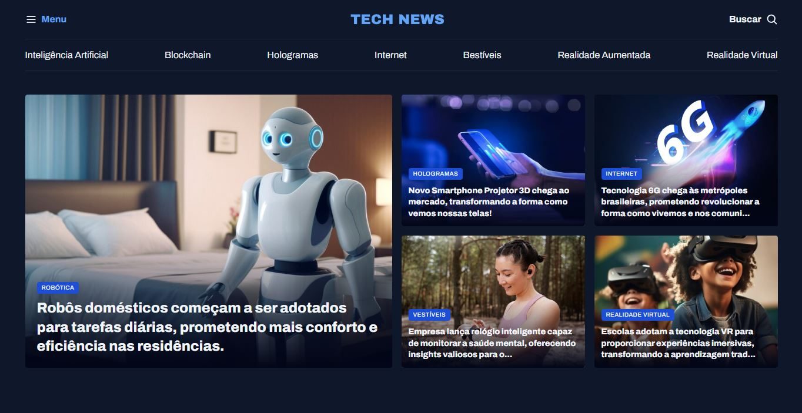

<h1 align="center">Projeto Portal de notícias</h1>

Feito para pratica de GRID em CSS

## Tecnologias

Esse projeto foi desenvolvido com as seguintes tecnologias:

- HTML e CSS 
- Git e Figma

## Projeto 

- Um esboço de portal de notícias e personalizada para Desktops.